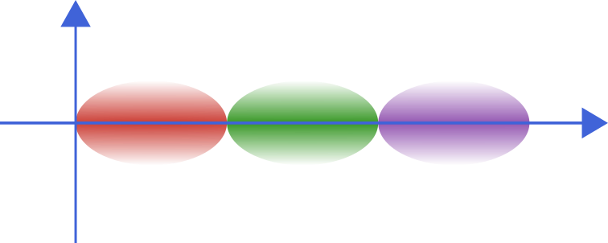

# Quantum State Base

Quantum states for quantum optics

| **Documentation** | **Build Status** | **Release** | **Website** |
|:-----------------:|:----------------:|:-----------:|:-----------:|
| [![doc stable badge]][doc stable link] <br> [![doc dev badge]][doc dev link] | [![ci badge]][ci link] [![codecov badge]][codecov link] <br> [![blue badge]][blue link] | [![latest release]][release link] [![latest release date]][release link] <br> [![license badge]][license link]| [![website badge]][website link] |

[doc stable badge]: https://img.shields.io/badge/docs-stable-blue.svg
[doc stable link]: https://foldfelis-QO.github.io/QuantumStateBase.jl/stable
[doc dev badge]: https://img.shields.io/badge/docs-dev-blue.svg
[doc dev link]: https://foldfelis-QO.github.io/QuantumStateBase.jl/dev

[ci badge]: https://github.com/foldfelis-QO/QuantumStateBase.jl/actions/workflows/CI.yml/badge.svg
[ci link]: https://github.com/foldfelis-QO/QuantumStateBase.jl/actions/workflows/CI.yml
[codecov badge]: https://codecov.io/gh/foldfelis-QO/QuantumStateBase.jl/branch/master/graph/badge.svg?token=EBN8JTY03A
[codecov link]: https://codecov.io/gh/foldfelis-QO/QuantumStateBase.jl
[blue badge]: https://img.shields.io/badge/code%20style-blue-4495d1.svg
[blue link]: https://github.com/invenia/BlueStyle

[latest release]: https://img.shields.io/github/v/release/foldfelis-QO/QuantumStateBase.jl
[latest release date]: https://img.shields.io/github/release-date/foldfelis-QO/QuantumStateBase.jl
[release link]: https://github.com/foldfelis-QO/QuantumStateBase.jl/releases/
[license badge]: https://img.shields.io/github/license/foldfelis-QO/QuantumStateBase.jl
[license link]: https://github.com/foldfelis-QO/QuantumStateBase.jl/blob/master/LICENSE

[website badge]: https://img.shields.io/website?url=https%3A%2F%2Ffoldfelis-qo.github.io%2FQuantumStateBase.jl%2F
[website link]: https://foldfelis-qo.github.io/QuantumStateBase.jl

<p align="center">
  
</p>

## Installation

The package can be installed with the Julia package manager.
From the Julia REPL, type `]` to enter the Pkg REPL mode and run:

```julia-repl
pkg> add QuantumStateBase
```

## Quick start

### Construct a squeezed thermal state and plot the Wigner function

```julia-repl
julia> using QuantumStateBase, Plots

julia> state = SqueezedThermalState(ξ(0.5, 3π/2), 0.3);

julia> wf = WignerFunction(-10:0.1:10, -10:0.1:10);

julia> w = wf(state);

julia> heatmap(w.x_range, w.p_range,  w.𝐰_surface')
```


