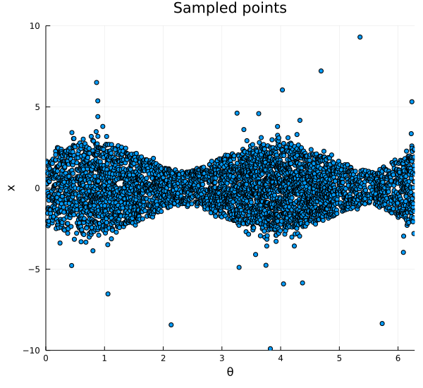

```@meta
CurrentModule = QuantumStateBase
```

# QuantumStateBase

Documentation for [QuantumStateBase](https://github.com/foldfelis-QO/QuantumStateBase.jl).

## Installation

The package can be installed with the Julia package manager.
From the Julia REPL, type `]` to enter the Pkg REPL mode and run:

```julia
pkg> add QuantumStateBase
```

## Quick start

### Construct a squeezed thermal state and plot the Wigner function

```julia
julia> using QuantumStateBase, Plots

julia> state = SqueezedThermalState(ξ(0.5, 3π/2), 0.3);

julia> wf = WignerFunction(-10:0.1:10, -10:0.1:10);

julia> w = wf(state);

julia> heatmap(w.x_range, w.p_range,  w.𝐰_surface')
```

```@raw html

```

### Plot quadrature probability density function of the state

```julia
julia> θs = LinRange(0, 2π, 100);

julia> xs = LinRange(-10, 10, 100);

julia> ps = q_pdf(state, θs, xs);

julia> heatmap(θs, xs, ps')
```

```@raw html


```

### Sample points from quadrature PDF of the state

```julia
julia> points = rand(state, 4096);

julia> scatter(points[1, :], points[2, :])
```

```@raw html

```
