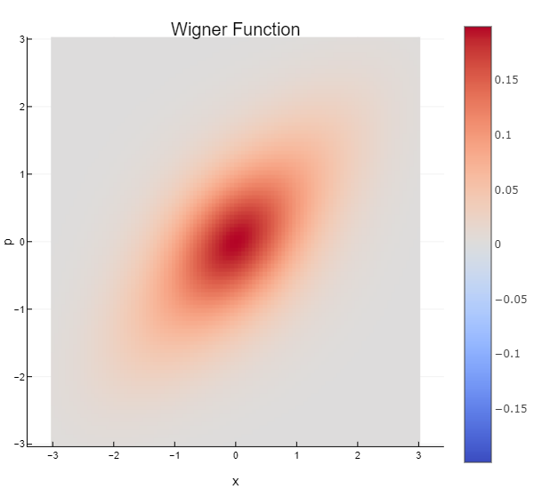

```@meta
CurrentModule = QuantumStateBase
```

# QuantumStateBase

Documentation for [QuantumStateBase](https://github.com/foldfelis-QO/QuantumStateBase.jl).

## Installation

The package can be installed with the Julia package manager.
From the Julia REPL, type `]` to enter the Pkg REPL mode and run:

```julia
pkg> add QuantumStateBase
```

## Quick start

### Construct a squeezed thermal state and plot the Wigner function

```julia
julia> using QuantumStateBase, Plots

julia> state = SqueezedThermalState(0.5, 3π/2, 0.3, dim=35);

julia> w = wigner(state, LinRange(-3, 3, 101), LinRange(-3, 3, 101));

julia> heatmap(w.x_range, w.p_range,  w.𝐰_surface')
```

```@raw html

```
